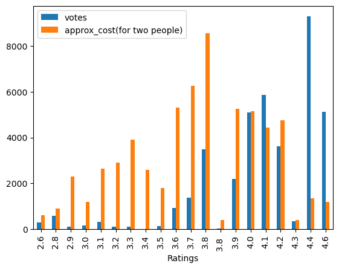

# Zomato Restaurants Data Analysis


```python
import pandas as pd
import numpy as np
import plotly.express as px
import matplotlib.pyplot as plt
import seaborn as sns
```


```python
df = pd.read_csv(r'C:/Users/DELL/Ayush Practise/Zomato data .csv')
df
```


<div>
<style scoped>
    .dataframe tbody tr th:only-of-type {
        vertical-align: middle;
    }

    .dataframe tbody tr th {
        vertical-align: top;
    }

    .dataframe thead th {
        text-align: right;
    }
</style>
<table border="1" class="dataframe">
  <thead>
    <tr style="text-align: right;">
      <th></th>
      <th>name</th>
      <th>online_order</th>
      <th>book_table</th>
      <th>rate</th>
      <th>votes</th>
      <th>approx_cost(for two people)</th>
      <th>listed_in(type)</th>
    </tr>
  </thead>
  <tbody>
    <tr>
      <th>0</th>
      <td>Jalsa</td>
      <td>Yes</td>
      <td>Yes</td>
      <td>4.1/5</td>
      <td>775</td>
      <td>800</td>
      <td>Buffet</td>
    </tr>
    <tr>
      <th>1</th>
      <td>Spice Elephant</td>
      <td>Yes</td>
      <td>No</td>
      <td>4.1/5</td>
      <td>787</td>
      <td>800</td>
      <td>Buffet</td>
    </tr>
    <tr>
      <th>2</th>
      <td>San Churro Cafe</td>
      <td>Yes</td>
      <td>No</td>
      <td>3.8/5</td>
      <td>918</td>
      <td>800</td>
      <td>Buffet</td>
    </tr>
    <tr>
      <th>3</th>
      <td>Addhuri Udupi Bhojana</td>
      <td>No</td>
      <td>No</td>
      <td>3.7/5</td>
      <td>88</td>
      <td>300</td>
      <td>Buffet</td>
    </tr>
    <tr>
      <th>4</th>
      <td>Grand Village</td>
      <td>No</td>
      <td>No</td>
      <td>3.8/5</td>
      <td>166</td>
      <td>600</td>
      <td>Buffet</td>
    </tr>
    <tr>
      <th>...</th>
      <td>...</td>
      <td>...</td>
      <td>...</td>
      <td>...</td>
      <td>...</td>
      <td>...</td>
      <td>...</td>
    </tr>
    <tr>
      <th>143</th>
      <td>Melting Melodies</td>
      <td>No</td>
      <td>No</td>
      <td>3.3/5</td>
      <td>0</td>
      <td>100</td>
      <td>Dining</td>
    </tr>
    <tr>
      <th>144</th>
      <td>New Indraprasta</td>
      <td>No</td>
      <td>No</td>
      <td>3.3/5</td>
      <td>0</td>
      <td>150</td>
      <td>Dining</td>
    </tr>
    <tr>
      <th>145</th>
      <td>Anna Kuteera</td>
      <td>Yes</td>
      <td>No</td>
      <td>4.0/5</td>
      <td>771</td>
      <td>450</td>
      <td>Dining</td>
    </tr>
    <tr>
      <th>146</th>
      <td>Darbar</td>
      <td>No</td>
      <td>No</td>
      <td>3.0/5</td>
      <td>98</td>
      <td>800</td>
      <td>Dining</td>
    </tr>
    <tr>
      <th>147</th>
      <td>Vijayalakshmi</td>
      <td>Yes</td>
      <td>No</td>
      <td>3.9/5</td>
      <td>47</td>
      <td>200</td>
      <td>Dining</td>
    </tr>
  </tbody>
</table>
<p>148 rows × 7 columns</p>
</div>


```python
df.info()
```

    <class 'pandas.core.frame.DataFrame'>
    RangeIndex: 148 entries, 0 to 147
    Data columns (total 7 columns):
     #   Column                       Non-Null Count  Dtype 
    ---  ------                       --------------  ----- 
     0   name                         148 non-null    object
     1   online_order                 148 non-null    object
     2   book_table                   148 non-null    object
     3   rate                         148 non-null    object
     4   votes                        148 non-null    int64 
     5   approx_cost(for two people)  148 non-null    int64 
     6   listed_in(type)              148 non-null    object
    dtypes: int64(2), object(5)
    memory usage: 8.2+ KB
    

### Q1) What type of restaurants do majority customers order from?


```python
df.groupby('listed_in(type)').count()
```


<div>
<style scoped>
    .dataframe tbody tr th:only-of-type {
        vertical-align: middle;
    }

    .dataframe tbody tr th {
        vertical-align: top;
    }

    .dataframe thead th {
        text-align: right;
    }
</style>
<table border="1" class="dataframe">
  <thead>
    <tr style="text-align: right;">
      <th></th>
      <th>name</th>
      <th>online_order</th>
      <th>book_table</th>
      <th>rate</th>
      <th>votes</th>
      <th>approx_cost(for two people)</th>
    </tr>
    <tr>
      <th>listed_in(type)</th>
      <th></th>
      <th></th>
      <th></th>
      <th></th>
      <th></th>
      <th></th>
    </tr>
  </thead>
  <tbody>
    <tr>
      <th>Buffet</th>
      <td>7</td>
      <td>7</td>
      <td>7</td>
      <td>7</td>
      <td>7</td>
      <td>7</td>
    </tr>
    <tr>
      <th>Cafes</th>
      <td>23</td>
      <td>23</td>
      <td>23</td>
      <td>23</td>
      <td>23</td>
      <td>23</td>
    </tr>
    <tr>
      <th>Dining</th>
      <td>110</td>
      <td>110</td>
      <td>110</td>
      <td>110</td>
      <td>110</td>
      <td>110</td>
    </tr>
    <tr>
      <th>other</th>
      <td>8</td>
      <td>8</td>
      <td>8</td>
      <td>8</td>
      <td>8</td>
      <td>8</td>
    </tr>
  </tbody>
</table>
</div>


```python
sns.countplot(x = df['listed_in(type)'])
plt.xlabel('Type of Restaurant')
```


    Text(0.5, 0, 'Type of Restaurant')


    

    


##### Observation
~ Majority orders are placed to Dining Restaurants

### Q2) How many votes does each type of restaurant got?


```python
votes_df = df.groupby('listed_in(type)').sum('votes')
result = votes_df['votes']
votes_df
```


<div>
<style scoped>
    .dataframe tbody tr th:only-of-type {
        vertical-align: middle;
    }

    .dataframe tbody tr th {
        vertical-align: top;
    }

    .dataframe thead th {
        text-align: right;
    }
</style>
<table border="1" class="dataframe">
  <thead>
    <tr style="text-align: right;">
      <th></th>
      <th>votes</th>
      <th>approx_cost(for two people)</th>
    </tr>
    <tr>
      <th>listed_in(type)</th>
      <th></th>
      <th></th>
    </tr>
  </thead>
  <tbody>
    <tr>
      <th>Buffet</th>
      <td>3028</td>
      <td>4700</td>
    </tr>
    <tr>
      <th>Cafes</th>
      <td>6434</td>
      <td>12550</td>
    </tr>
    <tr>
      <th>Dining</th>
      <td>20363</td>
      <td>39300</td>
    </tr>
    <tr>
      <th>other</th>
      <td>9367</td>
      <td>5350</td>
    </tr>
  </tbody>
</table>
</div>


```python
plt.plot(result, color = 'blue', marker = 'o')
plt.xlabel("Type of Restaurant", size = 20)
plt.ylabel('Votes', size = 20)
```


    Text(0, 0.5, 'Votes')


    

    


##### Observation
~ Dining restaurants have got maximum votes

### Q3) What are the ratings that majority restaurants have received?


```python
def clean_rate(rate):
    return rate.split('/')[0]

df['Ratings'] = df['rate'].apply(lambda x:f'{clean_rate(x)}')
df
```


<div>
<style scoped>
    .dataframe tbody tr th:only-of-type {
        vertical-align: middle;
    }

    .dataframe tbody tr th {
        vertical-align: top;
    }

    .dataframe thead th {
        text-align: right;
    }
</style>
<table border="1" class="dataframe">
  <thead>
    <tr style="text-align: right;">
      <th></th>
      <th>name</th>
      <th>online_order</th>
      <th>book_table</th>
      <th>rate</th>
      <th>votes</th>
      <th>approx_cost(for two people)</th>
      <th>listed_in(type)</th>
      <th>Ratings</th>
    </tr>
  </thead>
  <tbody>
    <tr>
      <th>0</th>
      <td>Jalsa</td>
      <td>Yes</td>
      <td>Yes</td>
      <td>4.1/5</td>
      <td>775</td>
      <td>800</td>
      <td>Buffet</td>
      <td>4.1</td>
    </tr>
    <tr>
      <th>1</th>
      <td>Spice Elephant</td>
      <td>Yes</td>
      <td>No</td>
      <td>4.1/5</td>
      <td>787</td>
      <td>800</td>
      <td>Buffet</td>
      <td>4.1</td>
    </tr>
    <tr>
      <th>2</th>
      <td>San Churro Cafe</td>
      <td>Yes</td>
      <td>No</td>
      <td>3.8/5</td>
      <td>918</td>
      <td>800</td>
      <td>Buffet</td>
      <td>3.8</td>
    </tr>
    <tr>
      <th>3</th>
      <td>Addhuri Udupi Bhojana</td>
      <td>No</td>
      <td>No</td>
      <td>3.7/5</td>
      <td>88</td>
      <td>300</td>
      <td>Buffet</td>
      <td>3.7</td>
    </tr>
    <tr>
      <th>4</th>
      <td>Grand Village</td>
      <td>No</td>
      <td>No</td>
      <td>3.8/5</td>
      <td>166</td>
      <td>600</td>
      <td>Buffet</td>
      <td>3.8</td>
    </tr>
    <tr>
      <th>...</th>
      <td>...</td>
      <td>...</td>
      <td>...</td>
      <td>...</td>
      <td>...</td>
      <td>...</td>
      <td>...</td>
      <td>...</td>
    </tr>
    <tr>
      <th>143</th>
      <td>Melting Melodies</td>
      <td>No</td>
      <td>No</td>
      <td>3.3/5</td>
      <td>0</td>
      <td>100</td>
      <td>Dining</td>
      <td>3.3</td>
    </tr>
    <tr>
      <th>144</th>
      <td>New Indraprasta</td>
      <td>No</td>
      <td>No</td>
      <td>3.3/5</td>
      <td>0</td>
      <td>150</td>
      <td>Dining</td>
      <td>3.3</td>
    </tr>
    <tr>
      <th>145</th>
      <td>Anna Kuteera</td>
      <td>Yes</td>
      <td>No</td>
      <td>4.0/5</td>
      <td>771</td>
      <td>450</td>
      <td>Dining</td>
      <td>4.0</td>
    </tr>
    <tr>
      <th>146</th>
      <td>Darbar</td>
      <td>No</td>
      <td>No</td>
      <td>3.0/5</td>
      <td>98</td>
      <td>800</td>
      <td>Dining</td>
      <td>3.0</td>
    </tr>
    <tr>
      <th>147</th>
      <td>Vijayalakshmi</td>
      <td>Yes</td>
      <td>No</td>
      <td>3.9/5</td>
      <td>47</td>
      <td>200</td>
      <td>Dining</td>
      <td>3.9</td>
    </tr>
  </tbody>
</table>
<p>148 rows × 8 columns</p>
</div>


```python
new_df = df.drop('rate', axis = 1)
new_df

```


<div>
<style scoped>
    .dataframe tbody tr th:only-of-type {
        vertical-align: middle;
    }

    .dataframe tbody tr th {
        vertical-align: top;
    }

    .dataframe thead th {
        text-align: right;
    }
</style>
<table border="1" class="dataframe">
  <thead>
    <tr style="text-align: right;">
      <th></th>
      <th>name</th>
      <th>online_order</th>
      <th>book_table</th>
      <th>votes</th>
      <th>approx_cost(for two people)</th>
      <th>listed_in(type)</th>
      <th>Ratings</th>
    </tr>
  </thead>
  <tbody>
    <tr>
      <th>0</th>
      <td>Jalsa</td>
      <td>Yes</td>
      <td>Yes</td>
      <td>775</td>
      <td>800</td>
      <td>Buffet</td>
      <td>4.1</td>
    </tr>
    <tr>
      <th>1</th>
      <td>Spice Elephant</td>
      <td>Yes</td>
      <td>No</td>
      <td>787</td>
      <td>800</td>
      <td>Buffet</td>
      <td>4.1</td>
    </tr>
    <tr>
      <th>2</th>
      <td>San Churro Cafe</td>
      <td>Yes</td>
      <td>No</td>
      <td>918</td>
      <td>800</td>
      <td>Buffet</td>
      <td>3.8</td>
    </tr>
    <tr>
      <th>3</th>
      <td>Addhuri Udupi Bhojana</td>
      <td>No</td>
      <td>No</td>
      <td>88</td>
      <td>300</td>
      <td>Buffet</td>
      <td>3.7</td>
    </tr>
    <tr>
      <th>4</th>
      <td>Grand Village</td>
      <td>No</td>
      <td>No</td>
      <td>166</td>
      <td>600</td>
      <td>Buffet</td>
      <td>3.8</td>
    </tr>
    <tr>
      <th>...</th>
      <td>...</td>
      <td>...</td>
      <td>...</td>
      <td>...</td>
      <td>...</td>
      <td>...</td>
      <td>...</td>
    </tr>
    <tr>
      <th>143</th>
      <td>Melting Melodies</td>
      <td>No</td>
      <td>No</td>
      <td>0</td>
      <td>100</td>
      <td>Dining</td>
      <td>3.3</td>
    </tr>
    <tr>
      <th>144</th>
      <td>New Indraprasta</td>
      <td>No</td>
      <td>No</td>
      <td>0</td>
      <td>150</td>
      <td>Dining</td>
      <td>3.3</td>
    </tr>
    <tr>
      <th>145</th>
      <td>Anna Kuteera</td>
      <td>Yes</td>
      <td>No</td>
      <td>771</td>
      <td>450</td>
      <td>Dining</td>
      <td>4.0</td>
    </tr>
    <tr>
      <th>146</th>
      <td>Darbar</td>
      <td>No</td>
      <td>No</td>
      <td>98</td>
      <td>800</td>
      <td>Dining</td>
      <td>3.0</td>
    </tr>
    <tr>
      <th>147</th>
      <td>Vijayalakshmi</td>
      <td>Yes</td>
      <td>No</td>
      <td>47</td>
      <td>200</td>
      <td>Dining</td>
      <td>3.9</td>
    </tr>
  </tbody>
</table>
<p>148 rows × 7 columns</p>
</div>


```python
plt.hist(df['Ratings'], color = 'blue', bins = 40 )
plt.title('Ratings Recieved by Restaurants')
plt.show()
```


    

    


##### Observation
~ Maximum restaurants have received rating between 3.3 - 4

### Q4) Average spending of couples on each other?


```python
results = new_df.groupby('approx_cost(for two people)').count()
results
```


<div>
<style scoped>
    .dataframe tbody tr th:only-of-type {
        vertical-align: middle;
    }

    .dataframe tbody tr th {
        vertical-align: top;
    }

    .dataframe thead th {
        text-align: right;
    }
</style>
<table border="1" class="dataframe">
  <thead>
    <tr style="text-align: right;">
      <th></th>
      <th>name</th>
      <th>online_order</th>
      <th>book_table</th>
      <th>votes</th>
      <th>listed_in(type)</th>
      <th>Ratings</th>
    </tr>
    <tr>
      <th>approx_cost(for two people)</th>
      <th></th>
      <th></th>
      <th></th>
      <th></th>
      <th></th>
      <th></th>
    </tr>
  </thead>
  <tbody>
    <tr>
      <th>100</th>
      <td>6</td>
      <td>6</td>
      <td>6</td>
      <td>6</td>
      <td>6</td>
      <td>6</td>
    </tr>
    <tr>
      <th>150</th>
      <td>16</td>
      <td>16</td>
      <td>16</td>
      <td>16</td>
      <td>16</td>
      <td>16</td>
    </tr>
    <tr>
      <th>200</th>
      <td>16</td>
      <td>16</td>
      <td>16</td>
      <td>16</td>
      <td>16</td>
      <td>16</td>
    </tr>
    <tr>
      <th>250</th>
      <td>6</td>
      <td>6</td>
      <td>6</td>
      <td>6</td>
      <td>6</td>
      <td>6</td>
    </tr>
    <tr>
      <th>300</th>
      <td>23</td>
      <td>23</td>
      <td>23</td>
      <td>23</td>
      <td>23</td>
      <td>23</td>
    </tr>
    <tr>
      <th>350</th>
      <td>3</td>
      <td>3</td>
      <td>3</td>
      <td>3</td>
      <td>3</td>
      <td>3</td>
    </tr>
    <tr>
      <th>400</th>
      <td>15</td>
      <td>15</td>
      <td>15</td>
      <td>15</td>
      <td>15</td>
      <td>15</td>
    </tr>
    <tr>
      <th>450</th>
      <td>6</td>
      <td>6</td>
      <td>6</td>
      <td>6</td>
      <td>6</td>
      <td>6</td>
    </tr>
    <tr>
      <th>500</th>
      <td>14</td>
      <td>14</td>
      <td>14</td>
      <td>14</td>
      <td>14</td>
      <td>14</td>
    </tr>
    <tr>
      <th>550</th>
      <td>3</td>
      <td>3</td>
      <td>3</td>
      <td>3</td>
      <td>3</td>
      <td>3</td>
    </tr>
    <tr>
      <th>600</th>
      <td>13</td>
      <td>13</td>
      <td>13</td>
      <td>13</td>
      <td>13</td>
      <td>13</td>
    </tr>
    <tr>
      <th>650</th>
      <td>2</td>
      <td>2</td>
      <td>2</td>
      <td>2</td>
      <td>2</td>
      <td>2</td>
    </tr>
    <tr>
      <th>700</th>
      <td>5</td>
      <td>5</td>
      <td>5</td>
      <td>5</td>
      <td>5</td>
      <td>5</td>
    </tr>
    <tr>
      <th>750</th>
      <td>3</td>
      <td>3</td>
      <td>3</td>
      <td>3</td>
      <td>3</td>
      <td>3</td>
    </tr>
    <tr>
      <th>800</th>
      <td>12</td>
      <td>12</td>
      <td>12</td>
      <td>12</td>
      <td>12</td>
      <td>12</td>
    </tr>
    <tr>
      <th>850</th>
      <td>2</td>
      <td>2</td>
      <td>2</td>
      <td>2</td>
      <td>2</td>
      <td>2</td>
    </tr>
    <tr>
      <th>900</th>
      <td>2</td>
      <td>2</td>
      <td>2</td>
      <td>2</td>
      <td>2</td>
      <td>2</td>
    </tr>
    <tr>
      <th>950</th>
      <td>1</td>
      <td>1</td>
      <td>1</td>
      <td>1</td>
      <td>1</td>
      <td>1</td>
    </tr>
  </tbody>
</table>
</div>


```python
couple_data = df['approx_cost(for two people)']
sns.countplot(x = couple_data)
plt.xlabel('Average spending of couples')
```


    Text(0.5, 0, 'Average spending of couples')


    

    


##### Observation
~ On an average couple spending is 300.

### Q5) Ratings given in diff modes( online/offline )


```python
new_df.head()
```


<div>
<style scoped>
    .dataframe tbody tr th:only-of-type {
        vertical-align: middle;
    }

    .dataframe tbody tr th {
        vertical-align: top;
    }

    .dataframe thead th {
        text-align: right;
    }
</style>
<table border="1" class="dataframe">
  <thead>
    <tr style="text-align: right;">
      <th></th>
      <th>name</th>
      <th>online_order</th>
      <th>book_table</th>
      <th>votes</th>
      <th>approx_cost(for two people)</th>
      <th>listed_in(type)</th>
      <th>Ratings</th>
    </tr>
  </thead>
  <tbody>
    <tr>
      <th>0</th>
      <td>Jalsa</td>
      <td>Yes</td>
      <td>Yes</td>
      <td>775</td>
      <td>800</td>
      <td>Buffet</td>
      <td>4.1</td>
    </tr>
    <tr>
      <th>1</th>
      <td>Spice Elephant</td>
      <td>Yes</td>
      <td>No</td>
      <td>787</td>
      <td>800</td>
      <td>Buffet</td>
      <td>4.1</td>
    </tr>
    <tr>
      <th>2</th>
      <td>San Churro Cafe</td>
      <td>Yes</td>
      <td>No</td>
      <td>918</td>
      <td>800</td>
      <td>Buffet</td>
      <td>3.8</td>
    </tr>
    <tr>
      <th>3</th>
      <td>Addhuri Udupi Bhojana</td>
      <td>No</td>
      <td>No</td>
      <td>88</td>
      <td>300</td>
      <td>Buffet</td>
      <td>3.7</td>
    </tr>
    <tr>
      <th>4</th>
      <td>Grand Village</td>
      <td>No</td>
      <td>No</td>
      <td>166</td>
      <td>600</td>
      <td>Buffet</td>
      <td>3.8</td>
    </tr>
  </tbody>
</table>
</div>


```python
mode_df = new_df.groupby('Ratings').sum('online_order')
mode_df.plot.bar()
```


    <Axes: xlabel='Ratings'>


    

    


### Q6) which type of restaurants received maximum offline orders?


```python
new_df.head()
```


<div>
<style scoped>
    .dataframe tbody tr th:only-of-type {
        vertical-align: middle;
    }

    .dataframe tbody tr th {
        vertical-align: top;
    }

    .dataframe thead th {
        text-align: right;
    }
</style>
<table border="1" class="dataframe">
  <thead>
    <tr style="text-align: right;">
      <th></th>
      <th>name</th>
      <th>online_order</th>
      <th>book_table</th>
      <th>votes</th>
      <th>approx_cost(for two people)</th>
      <th>listed_in(type)</th>
      <th>Ratings</th>
    </tr>
  </thead>
  <tbody>
    <tr>
      <th>0</th>
      <td>Jalsa</td>
      <td>Yes</td>
      <td>Yes</td>
      <td>775</td>
      <td>800</td>
      <td>Buffet</td>
      <td>4.1</td>
    </tr>
    <tr>
      <th>1</th>
      <td>Spice Elephant</td>
      <td>Yes</td>
      <td>No</td>
      <td>787</td>
      <td>800</td>
      <td>Buffet</td>
      <td>4.1</td>
    </tr>
    <tr>
      <th>2</th>
      <td>San Churro Cafe</td>
      <td>Yes</td>
      <td>No</td>
      <td>918</td>
      <td>800</td>
      <td>Buffet</td>
      <td>3.8</td>
    </tr>
    <tr>
      <th>3</th>
      <td>Addhuri Udupi Bhojana</td>
      <td>No</td>
      <td>No</td>
      <td>88</td>
      <td>300</td>
      <td>Buffet</td>
      <td>3.7</td>
    </tr>
    <tr>
      <th>4</th>
      <td>Grand Village</td>
      <td>No</td>
      <td>No</td>
      <td>166</td>
      <td>600</td>
      <td>Buffet</td>
      <td>3.8</td>
    </tr>
  </tbody>
</table>
</div>


```python
df_offline = new_df[new_df['online_order'] == 'No']
```


```python
df_offline.pivot_table( columns = 'online_order', index='listed_in(type)', aggfunc='size', fill_value = 0)
```


<div>
<style scoped>
    .dataframe tbody tr th:only-of-type {
        vertical-align: middle;
    }

    .dataframe tbody tr th {
        vertical-align: top;
    }

    .dataframe thead th {
        text-align: right;
    }
</style>
<table border="1" class="dataframe">
  <thead>
    <tr style="text-align: right;">
      <th>online_order</th>
      <th>No</th>
    </tr>
    <tr>
      <th>listed_in(type)</th>
      <th></th>
    </tr>
  </thead>
  <tbody>
    <tr>
      <th>Buffet</th>
      <td>3</td>
    </tr>
    <tr>
      <th>Cafes</th>
      <td>8</td>
    </tr>
    <tr>
      <th>Dining</th>
      <td>77</td>
    </tr>
    <tr>
      <th>other</th>
      <td>2</td>
    </tr>
  </tbody>
</table>
</div>


```python
df_offline.pivot_table( columns = 'online_order', index='listed_in(type)', aggfunc='size', fill_value = 0).plot.bar()
```


    <AxesSubplot:xlabel='listed_in(type)'>


    

    


##### Observation
~ Dining restaurants have received maximum offline orders, i.e,. 77.
